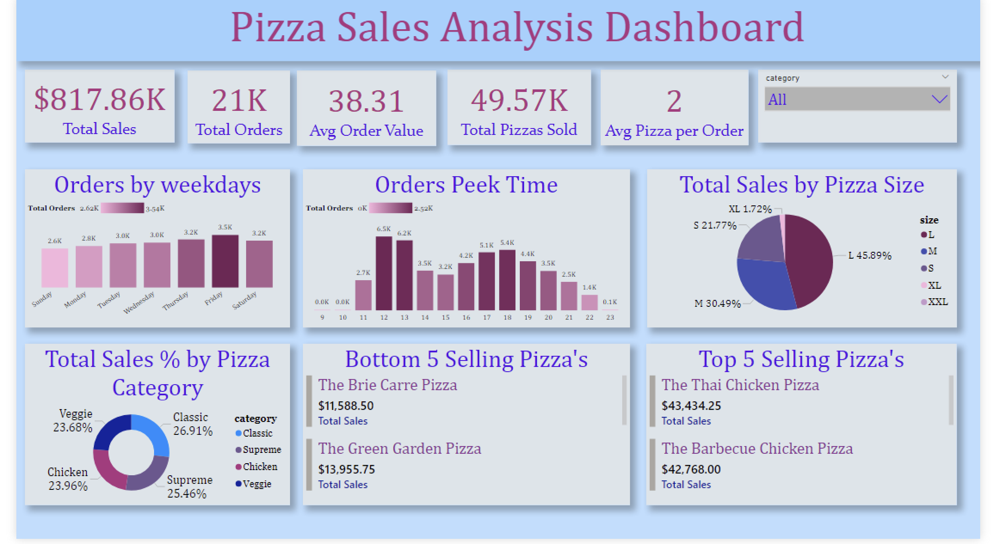

# 🍕 Pizza Sales Analysis Dashboard

## 📊 Project Overview

This Power BI dashboard analyzes pizza sales performance and customer ordering behavior. The objective is to identify sales trends, peak ordering hours, best-selling products, category performance, and customer purchasing patterns to support business decision-making.

---

## 🚀 Tools Used

* Power BI
* DAX
* Data Modeling
* Data Visualization
* Business Intelligence
* Sales Analytics

---

## 📈 Dashboard KPIs

* Total Sales: $817.86K
* Total Orders: 21K
* Average Order Value: $38.31
* Total Pizzas Sold: 49.57K
* Average Pizzas per Order: 2

---

## 📷 Dashboard Preview

---

## 🔍 Key Insights

### Sales Performance

* Generated total sales of $817.86K from 21,000 customer orders.
* Sold over 49,570 pizzas during the analysis period.
* Average customer order value was $38.31.

### Customer Ordering Trends

* Friday recorded the highest number of orders among all weekdays.
* Peak ordering hours occurred between 12 PM and 1 PM.
* Evening hours between 5 PM and 6 PM showed a second surge in customer demand.

### Product Performance

#### Top Selling Pizzas

1. The Thai Chicken Pizza – $43,434.25
2. The Barbecue Chicken Pizza – $42,768.00

#### Bottom Selling Pizzas

1. The Brie Carre Pizza – $11,588.50
2. The Green Garden Pizza – $13,955.75

### Category Analysis

Sales contribution by category:

* Classic: 26.91%
* Supreme: 25.46%
* Chicken: 23.96%
* Veggie: 23.68%

### Pizza Size Analysis

Revenue contribution by size:

* Large (L): 45.89%
* Medium (M): 30.49%
* Small (S): 21.77%
* XL: 1.72%

Large-sized pizzas generated the highest share of revenue.

---

## 🎯 Business Questions Answered

* Which pizza categories generate the highest revenue?
* Which pizza sizes are most popular among customers?
* What are the peak ordering hours?
* Which weekdays generate maximum orders?
* Which pizzas are top-performing and underperforming?
* What is the average customer order value?

---

## 🧠 Skills Demonstrated

* KPI Design
* Sales Analytics
* Product Performance Analysis
* Customer Behavior Analysis
* Dashboard Development
* Business Storytelling
* Data Visualization
* DAX Measures

---

## 👨‍💻 Author

Sachin

Aspiring Data Analyst | Power BI | SQL | Excel | Python

---

## ⭐ If you found this project useful, consider giving it a star on GitHub.
